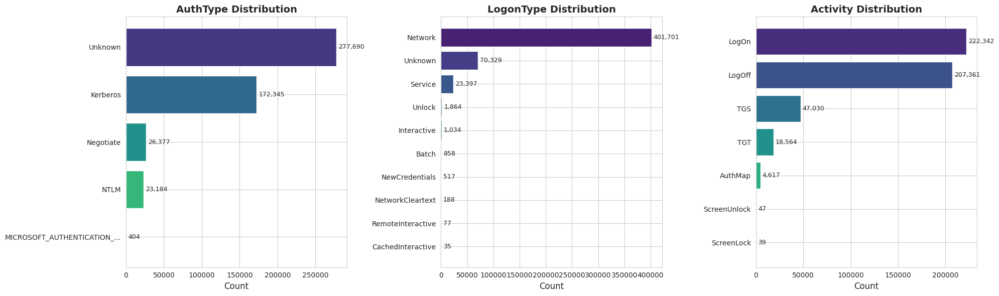
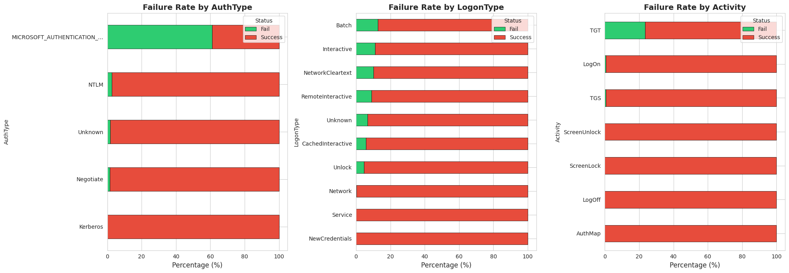
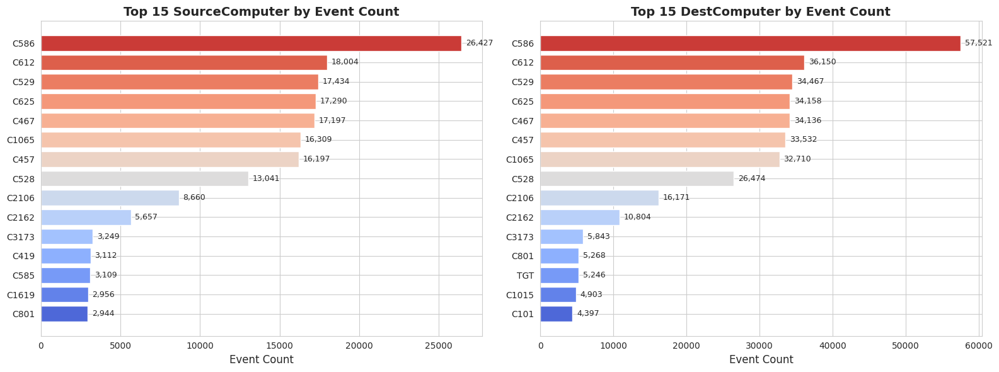
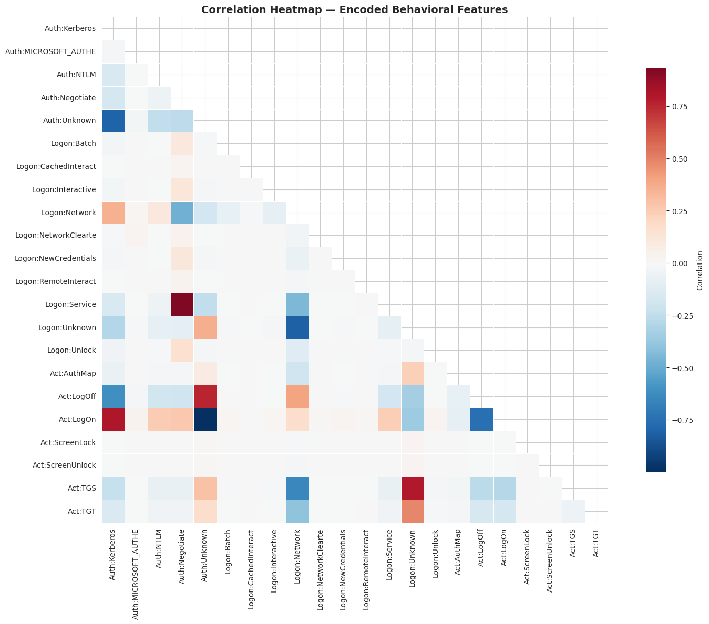
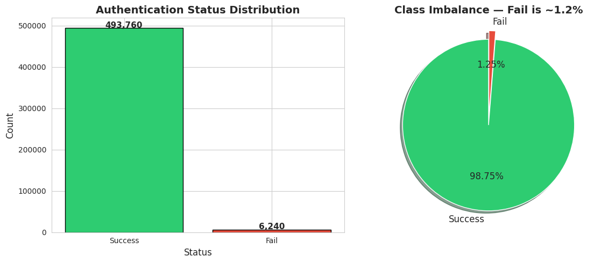
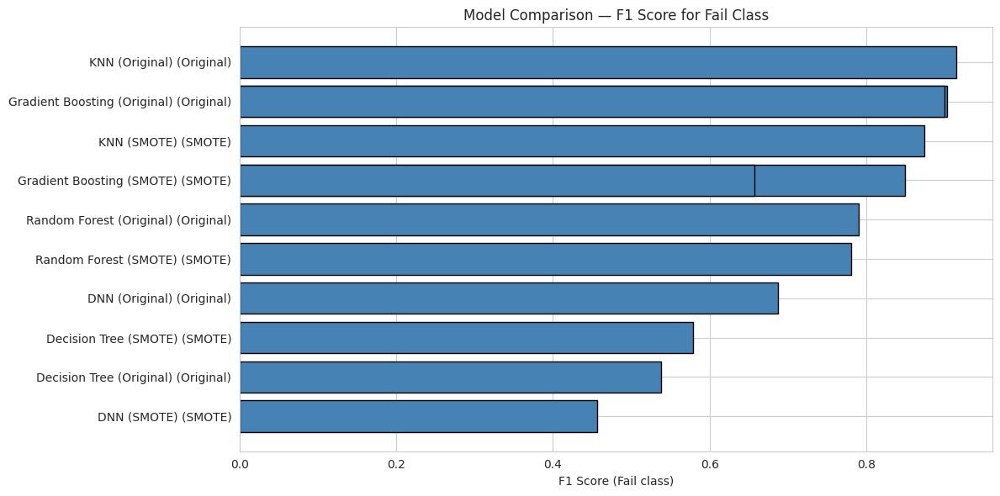
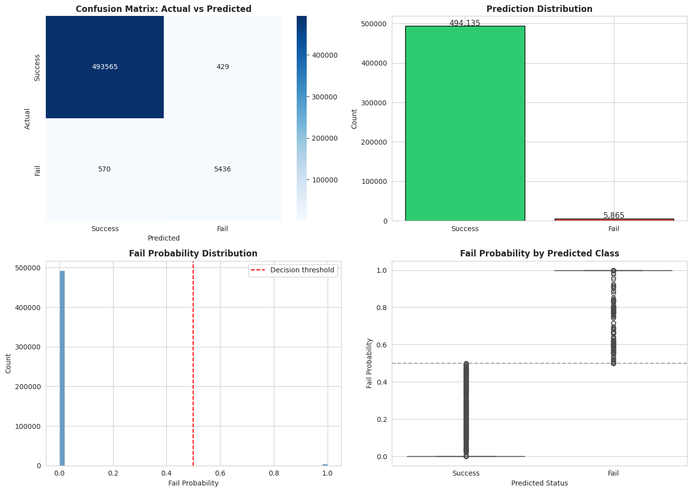
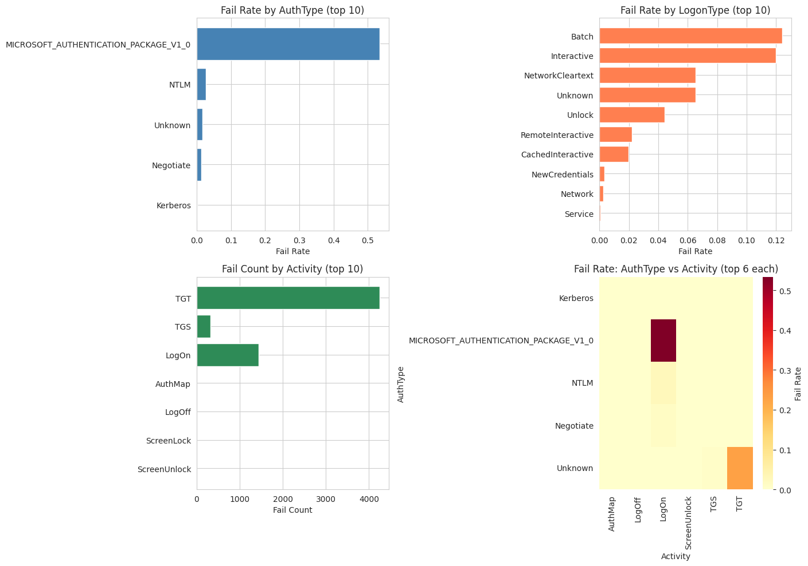
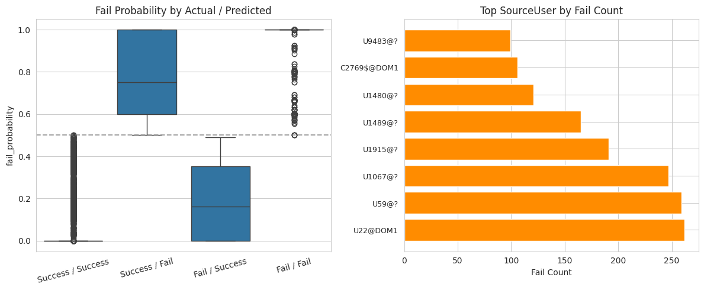

# LANL Network Authentication Classification

## Overview

This project analyzes the **Los Alamos National Laboratory (LANL) Unified Host and Network Dataset** to classify enterprise authentication events as normal (Success) or anomalous (Fail). The analysis follows **CRISP-DM methodology** and addresses authentication anomaly detection under severe class imbalance.

## Problem Statement

The challenge aligns with Cain et al. (Okta cybersecurity paper, arXiv:2411.07314v1): failures are rare, context is limited, and rule-based signals do not fully capture user behavior. This project focuses on **distinguishing meaningful behavioral patterns from identity-only features** so that unusual authentication activity can be recognized more reliably with fewer false positives.

### Research Question

Can behavioral authentication features (AuthType, LogonType, Activity) distinguish normal from anomalous enterprise authentication more effectively than identity-based features, and which modeling approaches best capture these patterns under severe class imbalance?

## Dataset

- **Source**: [LANL Unified Host and Network Dataset](https://csr.lanl.gov/data/2017/)
- **File**: `auth.txt` (~73 GB, 1+ billion events)
- **Sample**: 500,000 stratified random samples via chunked reservoir sampling
- **Structure**: 9 columns — Time*, SourceUser, DestUser, SourceComputer, DestComputer, AuthType, LogonType, Activity, Status
- **Note**: Time column is anonymized; temporal analysis is not possible.

## Methodology

### Leakage-Safe Pipeline

The feature engineering pipeline was rebuilt to eliminate target leakage:

- **Split before feature computation**: Train/test split occurs before any aggregate or identity-based features (per Furtado et al., arXiv:2508.07062).
- **Fit on train only**: All encodings and frequency mappings are fit on the training set; the test set is never used during feature construction.
- **No target-derived features**: Status, failure_rate, or any target-derived metric are excluded from predictors.

### SMOTE

SMOTE is applied only to training data (never to the test set). Each model is evaluated on two variants: **Original** (imbalanced training) and **SMOTE** (resampled training), both tested on the same held-out test set.

### Feature Categories

| Category   | Features                                              | Method                                  |
|-----------|--------------------------------------------------------|-----------------------------------------|
| Behavioral | AuthType, LogonType, Activity                          | OneHotEncoding (fit on train)            |
| Identity   | SourceUser, DestUser, SourceComputer, DestComputer     | Frequency/cardinality (from train only)  |






## Key Findings

1. **Severe class imbalance**: ~1.2% of events are failures (79:1 Success-to-Fail ratio).
2. **Behavioral features drive performance**: AuthType, LogonType, and Activity separate successes from failures more effectively than identity-only features.
3. **Best model**: **KNN (Original)** achieves the highest F1 for the Fail class (F1 ≈ 0.915) and was selected for deployment.
4. **SMOTE**: Evaluated for all models; for this dataset, the best KNN variant uses Original (non-SMOTE) training data.
5. **F1 for Fail**: Chosen as the primary metric because accuracy is misleading under imbalance (a naive baseline reaches ~98.8% by always predicting Success).



## Model Comparison (Top Performers)

| Model                  | Data Type | F1 (Fail) | Precision | Recall |
|------------------------|-----------|-----------|-----------|--------|
| KNN (Original)         | Original  | 0.915     | 0.924     | 0.907  |
| Gradient Boosting      | Original  | 0.900     | 0.920     | 0.881  |
| KNN (SMOTE)            | SMOTE     | 0.874     | 0.830     | 0.923  |







## Notebook

**[LANL_Auth_Classification.ipynb](LANL_Auth_Classification.ipynb)** — Full analysis including:

- Data loading and chunked reservoir sampling
- Data quality assessment (placeholders, duplicates, cardinality)
- Categorical cleaning (AuthType consolidation, placeholder handling)
- EDA with visualizations (class imbalance, feature distributions, heatmaps)
- Leakage-safe feature engineering
- Multiple models (Baseline, LR, DT, KNN, SVM, RF, GB, DNN) with Original and SMOTE variants
- Threshold tuning for probability-based models
- Consolidated results table and model comparison
- Post-model analysis and failure-pattern exploration
- Final pipeline lock-in and deployment on a new dataset

## Next Steps

- Stratified k-fold cross-validation for more robust performance estimates
- Grid search or randomized search for hyperparameter tuning (e.g., KNN)
- Anomaly detection framing (Isolation Forest, One-Class SVM)
- Decision threshold tuning based on cost of false positives vs. false negatives

## Repository Structure

```
Network_Classification/
├── README.md
├── LANL_Auth_Classification.ipynb
├── LANL_NetworkML_figures/       # PNG figures from the notebook
├── auth.txt                      # Raw dataset (not in repo if large)
├── knn_predictions_500k.csv      # Deployment predictions
└── Dataset_Lab.txt               # Dataset description
```
